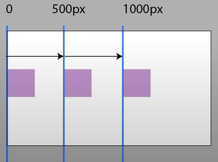
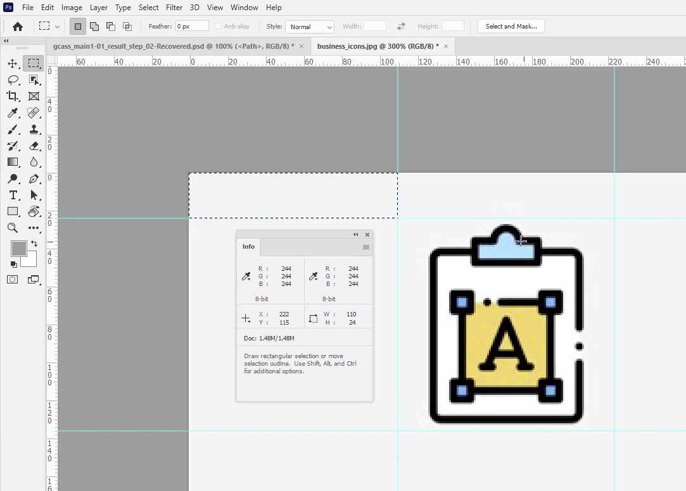
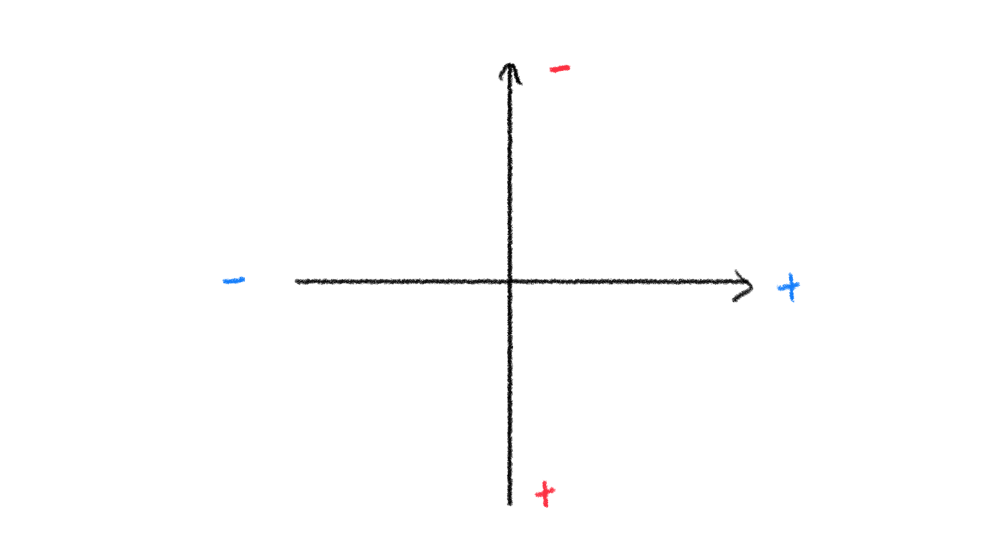

# Date 2021.11.03
## ✏️TIL
### background-image
#### 배경이미지 불러오기, 반복처리
  - <b>background-image: url();</b> = 배경이미지 불러오기
    - 배경이미지 무한반복
  - png와 jpg의 차이점 : 배경 유무 (jpg=흰색배경, png=투명배경)
  ---
  - <b>background-repeat:no-repeat;</b> = 반복기능 해제
    - repeat: 반복 <br />
    no-repeat: 반복 없앰 <br />
    repeat-x: 가로값만 반복 <br />
    repeat-y: 세로값만 반복 <br />
    대각선은 없음
    - 보이지 않더라도 반복하는 경우에는 no-repeat을 써주는게 좋음
  ---
  #### 위치선정
  - <b>background-position</b> = 위치 잡기
    - 기본위치 : 0 0 <br />
    오른쪽 상단 : right top (100% 0) <br />
    오른쪽 하단 : right bottom (100% 100%) <br />
    왼쪽 상단 : left top <br />
    왼쪽 하단 : left bottom <br />
    하단 가운데 : bottom center (50% 100%) <br />
    왼쪽 가운데 : left center <br />
    가운데 : 50% 50% <br />
    ... <br />
    [단위가 %인 경우]
     <br /> 
    [단위가 px인 경우] <br />
    
  - <b>background-size</b> = 배경사이즈 <br />
    - <b>큰 이미지를 강제로 줄이는 방법</b>
      - contain : 이미지 전체 다 보이도록 (남는 공간 O)
      - cover : 비율에 맞게 사진 자름
      - 기본 단위 : % (가로값 기준 ❓ auto가 숨겨져 있기 때문)
        - ex) background-size: 100% auto; <br />
          -> 가로값 100%, 세로값은 auto <br />
          ex) background-size: auto 100%; <br />
          -> 가로값 auto, 세로값 100% 
          ex) background-size: 100% 100% (X) <br />
          ➡️ 화면에 꽉 채우면서 이미지가 찌그러지지 않게 하는 방법은 없음
    - x,y 값 O width/height 값 O
---
#### 통합처리
  - background를 이용하여 통합
    - ex) background:url("../../img/icon/pig.png") no-repeat 50% 50%; <br />
    ➡️ <b>But</b>
    1. 구형 브라우저에서 호환 안됨
    2. 보기 불편함
    3. background-size는 같이 쓸 수 없음 (따로 써야 함) <br /> background-size를 무조건 뒤에 써야 함 <br />
      <b> 아래와 같이 쓰는 것을 권장함</b>
      ```
      background-position: 50% 0, 50% 50%, 100% 80%;
      background-image: url("../../img/icon/arrow.svg"), 
                        url("../../img/icon/chinchilla.png"), 
                        url("../../img/icon/pig.png");
      background-repeat: no-repeat, repeat-x, no-repeat;
      background-size: 20px auto, 50px auto, auto 25px; 
      ```
---
#### 그라데이션
- <b>background-image:linear-gradient(각도, colorA, colorB);</b> <br />
    ex) background-image: linear-gradient(45deg, #ccc, #fc0);
- 색상은 계속해서 추가 가능 (rgba도 가능)
```
background-image: 
    linear-gradient(45deg, #bbb 30%, #f50 40%, rgba(0,0,0,0) 40% );
➡️ 0~30%는 #bbb를 씀, 30%~0%까지는 #f50을 사용
➡️ #f50과 #d0d를 같은 40%로 두게되면 cuting이 됨 따라서, rgba(0,0,0,0) 40%를 넣어 투명하게 만들어줌
```
- background-image: radial-gradient();
  - 어떤 명령어 없이 색상만쓰는 경우에는 그 색상을 조금 더 연하게 나타냄
  - closest-side = 뒤에 색상을 포함하여 위아래양쪽 모두 컬러가 반영되게 함
    - 색상 여러개, % 모두 사용가능
  - circle = 원형으로 그림
    - background-image: radial-gradient(circle at 100%, #ccc, #a70) = 원형은 (오른쪽 끝) 100%의 위치에서부터 그리도록 함
```
✳️ background-color와 background-image가 같이 있는 경우는 color가 뒤로 감
✳️ text도 이미지 위로 올라옴
```
---
#### background-image를 fixed처리
- <b>background-attachment: ;</b>
  - scroll = 스크롤하면 그대로 보임
  - fixed를 쓰면 위에 쓴 size와 position이 틀어짐 <br />
    ❓ 브라우저 기준이기 때문
---
#### background-image 여러개 이미지 삽입
1. 포토샵에서 해당 이미지 파일 오픈
2. ruler(command+r)을 이용하여 사용할 이미지에 맞게 틀을 잡아줌
3. 이미지의 크기를 상자 툴로 잡아주어 크기를 확인 <br />
    💡 이때 이미지는 짝수로 불러오는게 좋음
4. background-positiond을 이용하여 좌표를 작성 <br />
    ➡️ 좌표확인 방법
    
    IS 기법 = background-position:-110px -24px; <br />
    w,h에 '-'를 줌<br />
    ❓ 해당 이미지를 틀로 옮기기 위하여 -/+를 붙여주는 것 (틀을 움직여 이미지에 맞출 순 없음) <br />
    
    IR 기법 = 이미지로 대처하고 텍스트를 숨기는 기법 (class="blind")
---
#### 버튼
- 공통내용은 분모에 묶어서 작성가능
- test1에 마우스를 올렸을 때(hover)&마우스로 눌렀을 때(action) y:-19px의 위치에 있던 이미지가 x:-240px로 바뀜
```
.test1 { background-position-y: -19px; }
.test1:hover { background-position-x: -240px; }
.test1:active { background-position-x: -380px; }
```
- <b>transition</b> = 애니메이션을 준 듯한 효과
    - ex) transition: all 300ms ease;
