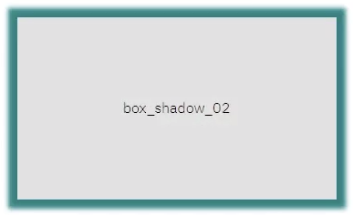
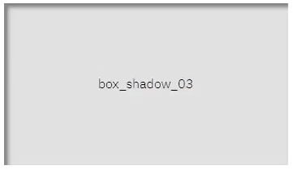
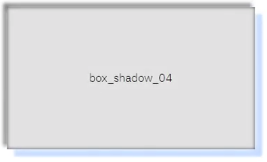

# Date 2021.11.04
## ✏️ TIL
### shadow_01
  - box-shadow = 그림자를 만드는 기법 <br />
    ➡️ box-shadow: x(px) y(px) blur(px) color(#); <br />
    ➡️ box-shadow: x(px) y(px) blur(px) 'offset(px)' color(#); <br />
      - offset = 그림자 크기_같은 크기의 상자가 뒤에 그려짐 (padding과 비슷한 효과) <br />
        - 더 크게 늘어나는 공간이 필요할때 사용
      ex) box-shadow: 5px 5px 5px 10px #ddf; <br />
       🔜 상자의 크기보다 10px씩 더 큰 상자가 뒤로 감<br /> 앞에 x,y,blur에 0을 쓰면 shadow효과 없음
       <br />

    ➡️ box-shadow: 'inset' x(px) y(px) blur(px) color(#) <br />
      - inset = 그림자가 안으로 생김
       <br />
  
    ➡️ 한 상자에 그림자 여러개 만들 수 있음
```
  box-shadow: 0 0 10px #fff,
              -5px -5px 5px #555,
              10px 10px 3px #adf,
              inset 0 0 15px #333;
```
  - 
📍 요약 <br />
box-shadow (그림자) <br />
box-shadow: 숫자px(1️⃣) 숫자px(2️⃣) 숫자px(3️⃣) 숫자px(4️⃣) 색상; <br />
1️⃣ 숫자가 커질 수록 오른쪽으로 감(x) <br />
2️⃣ 숫자가 커질 수록 밑으로 감(y) <br />
3️⃣ 숫자가 커질 수록 흐려짐(blur) <br />
4️⃣ 0이 원래 크기, '-'를 붙여야 작아짐(offset) <br />