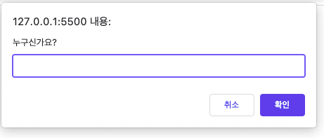
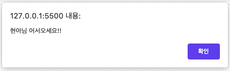
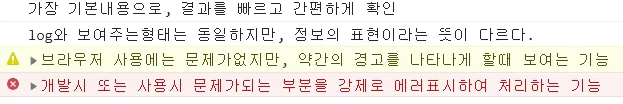

# Date 2021.11.08
## ✏️TIL
### javascript 작성
  > script 작성 방법 <br />
  
  1. `<head>` 태그 안에 `<script>`태그 사용하여 작성
  2. `<body>` 태그 안에 가장 먼저 `<script>`태그 사용하여 작성 (비추)
  3. `<body>` 태그 안에 가장 마지막에 `<script>`태그 사용하여 작성 (권장)
  4. script 파일을 분리하여 작성 (가장 권장)
  5. script를 `<body>` 태그 마지막에 쓰되 `<script src=""></script>`인 경로태그를 이용하여 작성 (가장 권장)
  - document.write(); = document에 쓰겠다는 의미
    - document(어디에) .write(이 이름에 따라서) ('')(기능을 수행)
    ```
    <script>
    document.write('head에 작성하여 나타나는 글자!!! <br />');    
    </script>
    ➡️ <br />을 html 문서로 인식
    ```
  - head에 쓴 script는 body에 쓴 script가 나타나고 처리 되기 전에 동작함

  🔑 무엇이 먼저 필요하느냐에 따라서 뒤에 있는 내용이 동작하느냐가 판가름됨 <br />
  script를 가장 마지막에 쓰는 것기 가장 유리함
  > script 주석 쓰는 방법
  - script는 html 소스에서 주석을 볼 수 있음 
  - // (한줄 주석) = 한줄만 쓸 수 있음 줄이 바뀌면 자동으로 풀림
  - /* */ (여러줄 주석) = css와 같음 여러줄 작성 가능

> 내부 script
  - document.write (''); = 브라우저에 글씨를 입력하여 결과를 확인하는 기능
  - alert (''); = 메세지 결과를 확인하는 기능
  - prompt ('누구신가요?'); <br />
   ➡️ 
  - var who = prompt ('누구신가요?'); <br />
  alert(who + '님 어서오세요!!'); <br />
  ➡️  <br />

✋🏻 who는 변수

>console 기능 
  - console.log(''); = 콘솔창에 나타나는 기능
    - 개발자 기준에서 내용을 중간 검증/체크/확인하기 위해 파악하는 기능으로 권장하는 기능
    - 가장 기본내용으로 결과를 빠르고 간편하게 확인
  - console.info(''); = log와 보여주는 형태는 동일하지만 정보의 표현이라는 뜻이 다르다.
  - console.warn(''); = 브라우저 사용에는 문제가 없지만 약간의 경고를 나타나게 할때 보여주는 기능
  - console.error(''); = 개발시 또는 사용시 문제가 되는 부분을 강제로 에러표시하여 처리하는 기능
  - console.clear(); = 콘솔 내용 삭제 <br />
  전체 결과
  

📌 <b>정리</b>
  - script는 `</body>` 바로 전에 src속성으로 불러오기
  - 한줄 주석 (//), 여러줄 주석(/* */)

---
### javascript 변수
- js는 ;의 의미가 해당 기능/내용의 종료를 의미
- js는 (), {}, [] ... 각종 괄호의 기능과 '', "" 기능이 수시로 열고/닫기 기능이 빈번하게 일어나며 그리고 복잡함 <br />
➡️ 괄호 모양이 바뀌는 순간 줄을 바꿔줘야함 (복잡하기 때문에 헷갈리기 쉬움)

- var로 선언 그 뒤에 쓰는 것은 변수
- 변수의 이름은 개인이 설정 하는 것 - 한글, 영문소문자, 임티(도 가능은 함)
```
var n;
    n=10
이라고 추후 값을 주기도 함
변수 설정을 많이 하는 경우에는
var a = 1;
var b = 1;
var c, d;
    c = 1, d=1;
라고 쓰기도 함
```
- 변수를 문자로 주고 싶을 땐 ''를 붙여줘야 함 <br />
ex) 'num'
- console.log(num, n, a, b, c, d)에서 ,로 표시한 것은 모두 따로라고 보면 됨 <br />
console.log(num:, num); -> num:0 이라고 표시 됨
- javascript에서 문자는 검정색 또는 ''가 빨간색으로 표시, 숫자는 파란색으로 표시 됨
- 예약어 : 변수명으로 사용할 수 없는 용어는 미리 선정해놓은 용어 
  - var, console 변수로 쓸 수 없음
  - 예약어 후보 : name (될때도 안될때도 있음)
  - 예약어는 전부 알 필요는 없음 (인터넷에 검색하면 다 나옴) <br />

📍 변수명을 설정하는 가장 쉬운방법 <br />
  1. 의미없는 변수는 사용하지 말것 (단, 숫자나 단순 값을 가져오기 위한 상황 제외)
  2. 각 변수를 'camelCase방식'으로 사용할것 
  3. js에서는 대시라인방식(-), 언더스코어(_) 방식의 이름을 권장하지 않음<br />

📍 - ;사용위치
  1. 변수 할당 또는 변경;  
  2. 함수수행(); , 객체.메소드();

📌 <b>정리</b> <br />
- 변수 선언은 var 먼저 선언 (한번 선언한 이름은 다시 var을 사용하지 않음)
- js는 다소 복잡한 구조들로 보이고 혼란 있을 수 있으니 꼭 들여쓰기, 괄호체크 필수
- 예약어: 변수는 일부 사용되는 용어를 피해서 작성
- ;작성위치: 변수 선언 또는 값 대입시, 함수실행, 메소드 실행
---
### javascript 호이스팅
- 호이스팅 현상의 호이스트란 (견인차의 갈고리를 말함) - 코드를 끌어올림
- 모든 자바스크립트는 절차지향
- console.log();는 항상 어떤 변수 뒤에 작성하여 콘솔창에 결과를 도출시키는 코드
<hr />

> 변수 호이스팅
- 변수 호이스팅 현상에서 보여주고자 하는 것은 console.log()를 먼저 써도 undefined라는 결과는 나온다 <br />
❓ var text = '글자입력';은 =을 기준으로 좌변과 우변으로 나뉘는데 좌변(변수명)이 console.log(); 위로 알아서 끌어올려지기 때문이며 ➡️ 이를 호이스팅이라고 함
- 호이스팅 현상은 변수의 좌변이 위로 끌어올려진다고 했지만 위로 올라간 것이 실제로 눈에 보이진 않는다
```
<javascript>
console.log(text);
var text = '글자입력';
⬇️
<console>
undefined
``` 
✋🏻 undefined 란? 미정 이라는 뜻으로 코드에선 값이 있으나 정해지지 않았다고 해석한다.
<hr />

>함수 호이스팅
- 함수 호이스팅에서도 변수 호이스팅과 같은 결과를 보여준다. <br />
➡️ 함수 호이스팅은 함수가 통째로 올라가버리기 때문에 결과가 '호출!!!!'이라는 값이 그대로 나온다.
```
<javascript>
fn();

function fn(){
  console.log('호출!!!!');
}
⬇️
<console>
호출!!!!
```
- 함수를 호출하는 방법은 함수이름 + () + ; <br />
```
function 함수이름(){
console.log();
}

함수이름(); 
```
✋🏻 var = 변수 function = 함수

📌 <b>요약</b>
  - 호이스팅이란? <br />
  변수/함수 생성 시 호출을 먼저 한 뒤 생성하여도 해당 이름/기능이 상단으로 끌어올려진 것처럼 처리 되어 결과가 도출 <br />
➡️ 호이스트 현상이 있으니 유의해야 함
  - 차이점 <br />
  ▶️ 변수 호이스팅: 좌변(변수명)만 끌어올려져서 undefined라는 값이 나오는 것 <br />
  ▶️ 함수 호이스팅: 함수가 통째로 끌어올려져서 결과값이 그대로 나오는 것

🔑 작업순서를 지켜쓰는 것이 good
  1. 변수 선언
  2. 함수 정의
  3. 기능 구현