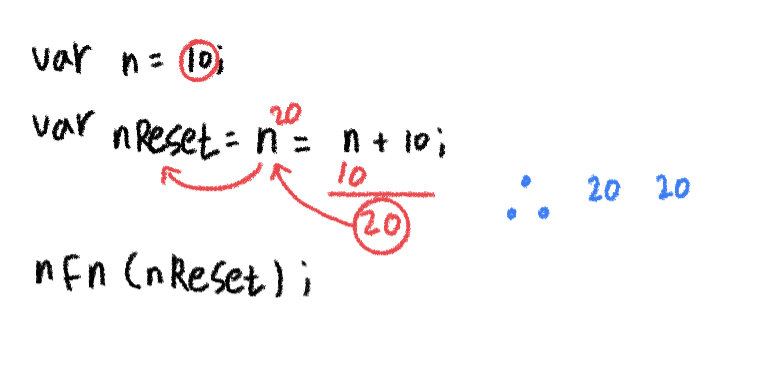

# Date 2021.11.10
## ✏️ TIL
### 연산자
> 사칙연산
- 4가지 법칙에 의한 연산처리
  - `+` 덧셈
  - `-` 뺄셈
  - `/` 나누셈 (소수점까지 다 나옴)
  - `*` 곱셈
  - `%` 나눗셈의 몫이 아닌 나머지
- 원본을 바꾸는 것이 아닌 별도의 변수를 가지고 수정
```
var n = 10;
var nReset = n = n + 10;
nFn(nReset);
⬇️
20 20
-----------------
❓ n은 10에 +10을 해서 20 이 20이 변수 n에 재할당되고 nReset에 값을 담음
```


---

> 할당/복합대입연산자
- 자기자신에게 값을 이용하여 대입처리하고자 할때 사용하는 연산자
- n+=/n-=/n*=(자신에게 곱셈)/n/=(자신에게 나누기)/n%=
✋🏻 여기서 n은 변수
```
1️⃣
n=140;
n += 60;
⬇️
200
-----------------
❓n+=60은 n값에 60을 더하겠다는 얘기
n=n+60;
▶️ n,=은 구분하기 위한 것으로 n은 변수명 =은 대입연산 n+60에서 n은 다시 변수에 +더한다 60을 이라는 의미
▶️ +와 =은 띄어쓰기하면 안됨
```

---

> 증감연산자
- 1씩 더하거나, 뺄때 사용하는 연산자로 전치/후치 연산이 
- n++: 결과 도출 후 1 더하기(전치) / ++n: 1 더하기 후 결과 도출(후치)
- n--: 결과 도출 후 1 빼기(전치) / ++n: 1 빼기 후 결과 도출(후치)
```
n = n + 1;                    /             n = n - 1;
n += 1;                       /             n -= 1;
n++;                          /             n--;
++n;                          /             --n;
➡️ 4가지 모두 같은 결과를 도출
```

---

> 삼항연산자
- 3가지 항목으로 나눠 사용하는 연산자로 조건문과 유사한 성향
- ()?:; <br /> 
➡️ (조건) ? 조건결과가 참이면 실행 : 결과가 거짓이면 실행;
- 참/거짓에 수행하는 내용은 무조건 한줄이어야 함
- 참과 거짓이 무조건 하나씩 있어야 함

----

> 비교연산자
- 좌변 우변을 비교하여 true/false를 도출하는 연산자
- ||, && 비교연산자는 좌변과 우변을 비교하여, true/false를 찾아내는 기법
- 한쪽이 완전한 충족을하면 다른 쪽은 비교하지 않음
- 비교연산자가 한개인( |, & )사용시 결과는 0,1로 도출
- 🔑 조금이라도 빠른 연산을 위해 ||은 true가 나오기쉽거나 우선이되는 내용을 좌변에 배치 / &&는 falser가 나오기 쉽거나 우선이 되는 내용을 좌변에 배치

==,=== 차이점<br />
==: 타입은 비교하지 않음 (거의 사용 X)
===: 타입도 비교함

|종류|설명|
|----|----|
|A > B| A가 B보다 크다
|A < B| A가 B보다 작다
|A >= B| A가 B보다 크거나 같다
|A <= B| A가 B보다 작거나 같다
A===B| A와 B는 같다
A!===B| A와 B는 다르다.

✋🏻
-  ||: or ( 둘 중에 하나라도 참이면 참) &&: and(둘 다 참이어야 참 그렇지 않으면 거짓)
- 비교연산자를 한개 즉, |, & 이처럼 사용시 결과는 0,1로 도출
