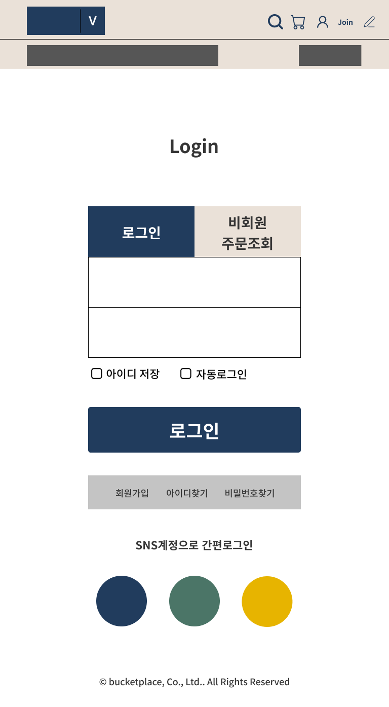

# Date 2021.11.15
## ✏️ TIL
# 얕은 변수/깊은변수
> 얕은변수
  - 주소지만 복사 x=y;같은 형식
  - 서로의 변화가 있을때 서로에게 영향을 미침

> 깊은변수
- 참조값은 주소지를 공유한다
  - 원시타입 : 참조변수를 제외한 변수 undefined, null ... 6가지가 원시타입 <br />
  ❓ 원시타입과 참조타입의 차이점 <br />
    주소를 공유하는가 아닌가의 차이
- 값이 들어있는게 아니라 메모리 주소가 들어 있는 것<br />
❓ 변수 값을 호출하면 바인딩 되어 있는 곳을 찾아가면 메모리 값이 아닌 주소가 들어 있음 메모리 주소만 공유했기때문에 위에 있는 주소에만 영향이 가고 값이 바뀌면 밑에 주소에 값을 바뀜

➡️ 깊은 복사는 메모리 주소를 통째로 복제(clone)하여 서로의 변화에 영향을 미치지 않음


🧷 객체

  - 객체는 중복을 허용하지 않는다 그래서 덮어씌어짐
  - 2가지 방법(마침표 표기법/ 대괄호 표기법)
    - 마침표 표기법
      ```
      var obj={};
      obj.name="daye";
      ```
    - 대괄호 표기법
      ```
      obj['age']=26;
      ```
🧷 배열

  - 배열.Push('추가할 내용');
  - 배열에서는 for문, 객체에서는 for in문 사용

✋🏻 for문 기본형태 <br>
  ```
  for (var i; i < 5; i++){
  수행할 코드
  }
  for(어디서부터 시작; 어디까지 반복할 것인지; 어떻게 반복을 할건지)
  ;으로 구분
  ```  
  EX)
  ```
  var copyColor=[];
  // for 반복문=깊은 복사
  for(var i=0; i<5;i++){
  copyColor[i]=favoritColor[i];
  }
  ```

✋🏻 for in문 기본형태
```
for(var data in pc){
  // console.log( data );
  clonePc[data] = pc[data];
}

// for(in){} -> for in문

/* 값 자체에 접근하기
for(var key in pc(원본)){
  clonePc[key]=pc[key];->clonePc의 key(변수명)와 pc의 key는 같다
}
```

✋🏻 length는 배열이 몇개까지 있는지 세어줌

📝 숙제

문제. 깊은 복사를 한 뒤 원하는 제품 하나를 추가하세요
>1번문제

```
var cookie = ['초코칩','칙촉','빼빼로','호빵','촉촉한초코칩','칸쵸','홈런볼','엄마손'];
var cloneCookie=[];

🖨 깊은복사
for (var i = 0; i<cookie.length;){
cloneCookie.push(cookie[i]);
}

➕ 제품추가
console.log(cookie === cloneCookie);
cloneCookie.push('고래밥');
console.log(cookie, cloneCookie);

👉🏻 결과
[ '초코칩', '칙촉', '빼빼로', '호빵', '촉촉한초코칩', '칸초', '홈런볼', '엄마손' ]
[ '초코칩', '칙촉', '빼빼로', '호빵', '촉촉한초코칩', '칸초', '홈런볼', '엄마손', '고래밥' ]
```
>2번문제
```
var snack = { '농심':'새우깡', '해태':'맛동산', '오리온':'고래밥', '크라운':'산도' };
var cloneSnack={};

🖨 깊은 복사
for (var key in snack) {
  cloneSnack[key]=snack[key];
  // 들어갈 아이=들어올 곳
}

➕ 제품 추가
snack.롯데 = '빈츠';
// snack.롯데(식별자);
cloneSnack['삼우식품']='찰떡파이';

👉🏻 결과
{ '농심': '새우깡', '해태': '맛동산', '오리온': '고래밥', '크라운': '산도' } 
{ '농심': '새우깡', '해태': '맛동산', '오리온': '고래밥', '크라운': '산도', '롯데': '마가렛트' }
```

📚 오늘 수업시간
- 피그마 반응형 과제 시험
<details>
<summary>반응형 자료 click🖱</summary>
💙 메인페이지 <br />
    320px <br />
    <br />
    768px <br />
    <br />
    1280px <br />
    <br />
    1440px <br />
    <br />
💚 서브페이지 <br />
    320px <br />
      <br />
    768px <br />
      <br />
    1280px <br />
      <br />
    1440px <br />
      <br />
    320px <br />
    <br />
    768px <br />
    <br />
    1280px <br />
    <br />
    1440px <br />
    <br />
    320px <br />
    <br />
    768px <br />
    <br />
    1280px <br />
    <br />
    1440px <br />
    <br />
</details>

- 얕은 복사/깊은 복사